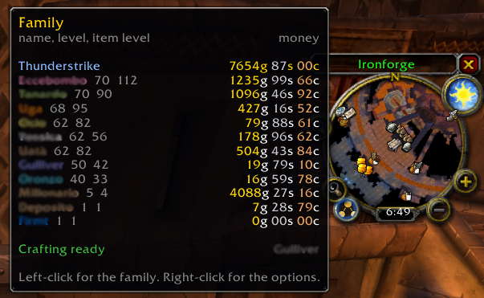
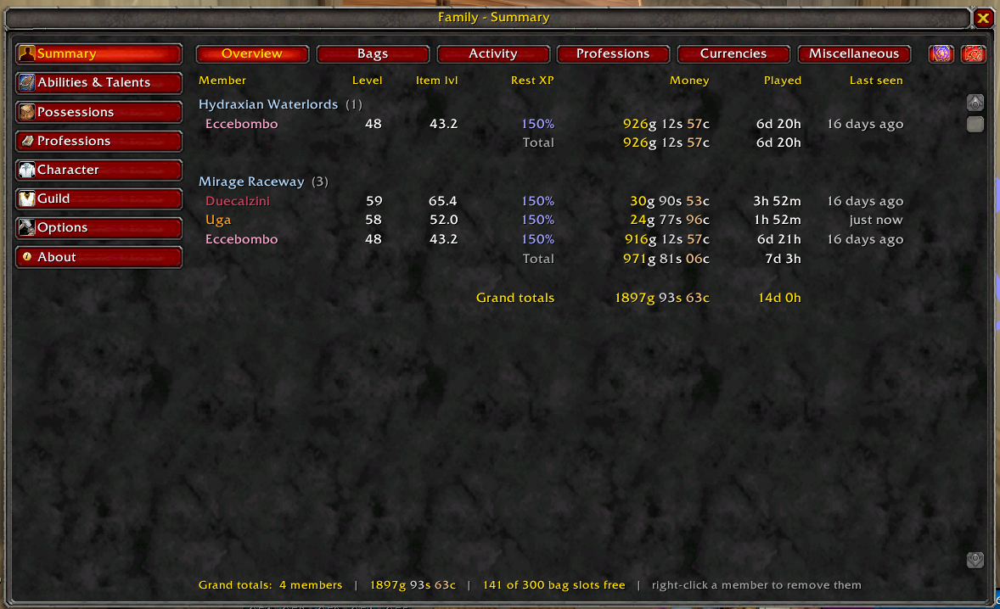
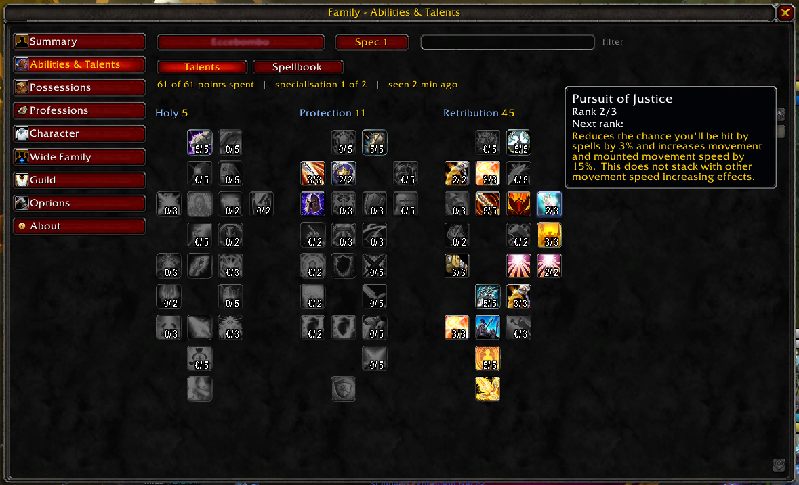
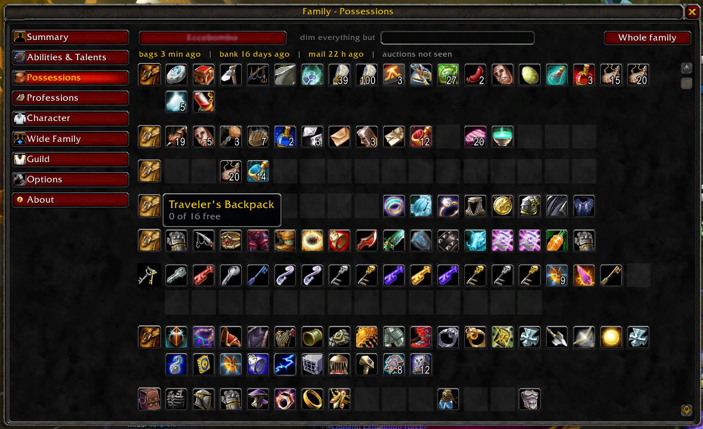
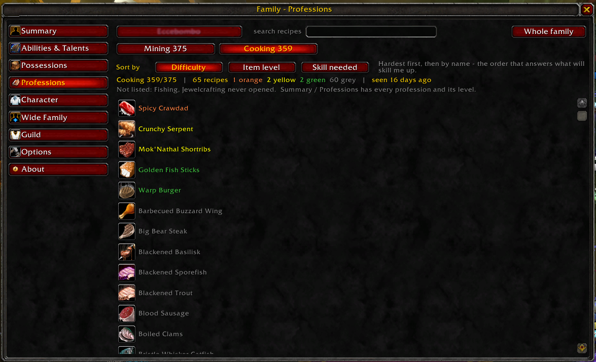
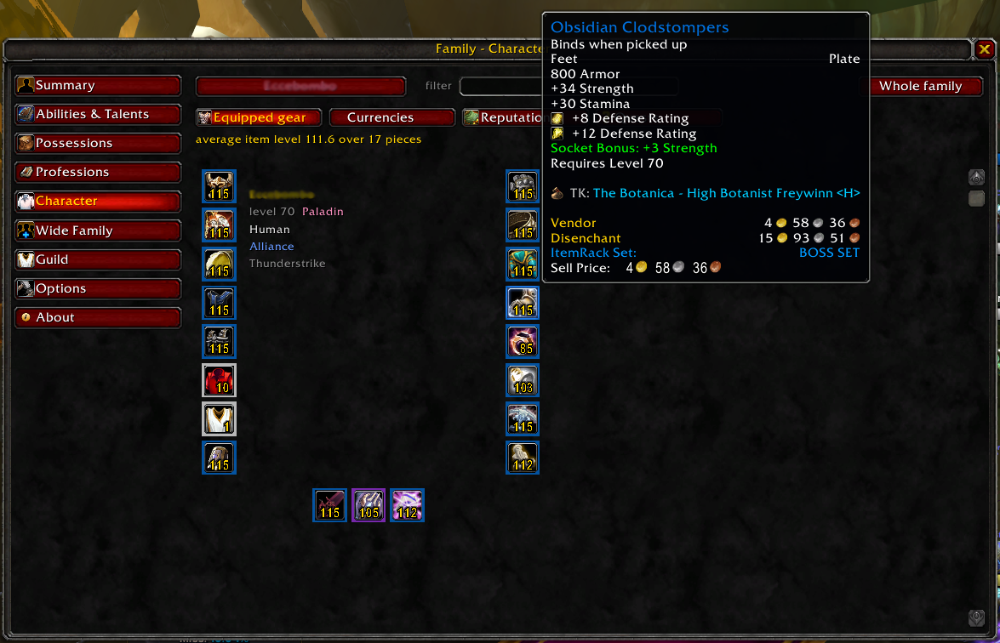
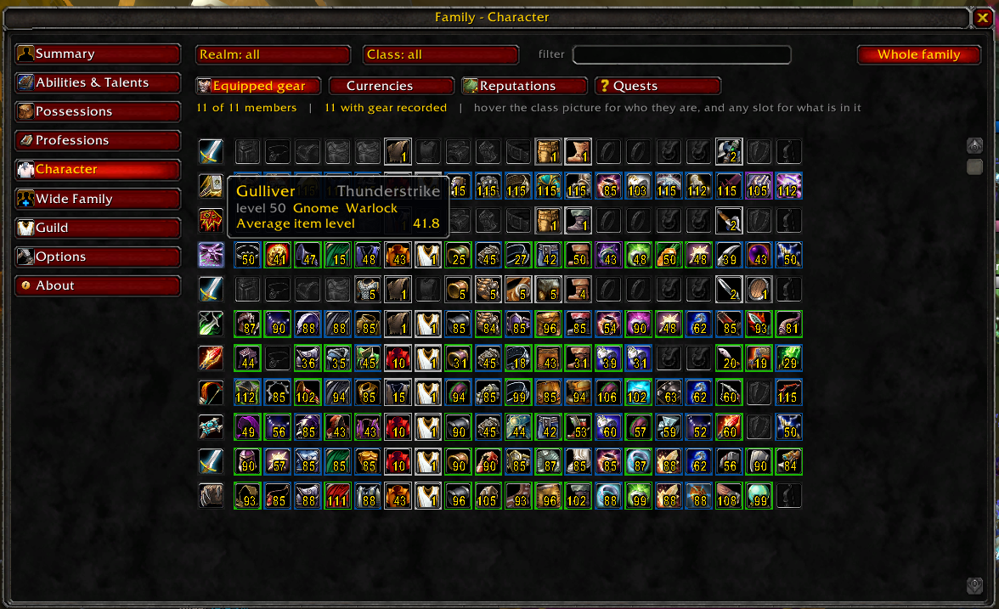
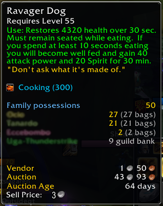

# Family — the manual

An alt manager for World of Warcraft Classic. It records what each of your characters owns
and knows, and shows it to you while you are logged in on a different one.

This is the long version. There is a short one inside the addon, on the **About** tab, and it
covers enough to get started; this document is for when you want to know why something says
what it says.

---

## Contents

1. [The five minutes that matter](#1-the-five-minutes-that-matter)
2. [Opening Family](#2-opening-family)
3. [Summary](#3-summary)
4. [Abilities & Talents](#4-abilities--talents)
5. [Possessions](#5-possessions)
6. [Professions](#6-professions)
7. [Character](#7-character)
8. [On the game's own tooltips](#8-on-the-games-own-tooltips)
9. [Searching the whole family](#9-searching-the-whole-family)
10. [Crafting cooldowns](#10-crafting-cooldowns)
11. [Wide Family](#11-wide-family)
12. [Guild share](#12-guild-share)
13. [Options](#13-options)
14. [What Family will not do, and why](#14-what-family-will-not-do-and-why)
15. [When something looks wrong](#15-when-something-looks-wrong)

> **Screenshots.** These live in `docs/images/`, named for what they show rather than
> numbered, so adding one later renumbers nothing. Two are still to be taken and the manual
> says so where they belong, rather than showing a broken picture.

---

## 1. The five minutes that matter

Three things are worth knowing before anything else, because between them they explain almost
every question anybody asks about Family.

**It starts empty, and it imports nothing.** Family records the character you are playing, as
you play. A character appears in it the first time you log in on them. A family of ten takes
ten logins to be complete, and then stays complete on its own. There is no import from any
other addon and there never will be, and that is not going to change.

**It speaks your language.** Family is written in English, German, French, Spanish and
Russian, and follows whatever your client is set to. Where the game already has a word for
something — a gear slot, a class, a reputation standing, a profession, a race — Family uses the
game's own word rather than one of its own, so it says what the rest of your interface says.
Anything not yet translated appears in English rather than as a blank.

**Three windows need opening once per character.** Bags, money, gear, skills, talents,
currencies and quests are read without being asked. Three things are only visible to the game
while their own window is open, so open each of these once on each character and Family has
them from then on:

| Open this | To record |
|---|---|
| your **bank**, at any bank | what is in it, and how many slots are free |
| your **mailbox** | what is waiting, and when it expires |
| each **profession** window | the recipes in it, and their difficulty |

**Nothing is ever reported as empty when it was simply never seen.** A bank nobody has opened
reads *not seen*, not *0 items*. A profession cooldown that started while the window was shut
is not known until the window is next opened, and Family says *no cooldown seen* rather than
*no cooldown*. Every screen states how old what it is showing is.

That last one is the principle the whole addon is built on. If a number looks wrong, the first
question is nearly always *when did Family last see it* — and the answer is on screen.

---

## 2. Opening Family

| How | What it does |
|---|---|
| `/family` or `/fam` | opens the window |
| `/family help` | lists everything that can be typed |
| **minimap button**, left-click | opens Family on the summary |
| **minimap button**, right-click | opens the options |
| **minimap button**, drag | moves it around the edge of the minimap |
| any **data broker** bar | the same, with the family's money on it |
| **shift-click** the button or the broker | changes what the money counts |

The money **shift-click** cycles through three answers: the whole family, everybody on this
side of this realm, and the character you are playing. The member count beside it narrows with
it, and the tooltip says which of the three you are looking at whenever it is not the whole
family. A middle click does the same, for the hands that prefer it.

Three rather than two, because a grand total across every realm is a number nobody can spend:
two sides of one realm share no bank, no mailbox and no auction house. The warning about mail
expiring deliberately does **not** narrow — mail rotting three realms away is precisely what
nobody is looking at.

Clicking for the place you are already looking at closes the window. Left-click always lands
on the summary and right-click always lands on the options — an entry point that goes
somewhere different depending on what you did last is not an entry point.

Hovering the minimap button or the broker gives the whole family at a glance: every realm,
every member with their level and item level, the money, and anything ready or expiring.

**It fits your screen, however many characters you have.** The realm totals, the grand total
and the warnings are always drawn; the list of characters takes whatever room is left, and says
`and 14 more` where it had to stop. Which characters survive is decided by money, richest
first, and the realm you are standing on is served before the others. A family that already
fitted looks exactly as it did — none of this happens until it has to.

The grand total is always the sum of the realms listed above it. If you have changed what the
**bar** counts, the tooltip still shows everybody and says near the bottom what the bar itself
is counting, which is the one number that narrowed.

---

## 3. Summary

Every member on one line, grouped by realm, with a totals line under each realm and a grand
total under all of them when there is more than one.

The buttons across the top change **which columns** are shown rather than which members:

| Set | Answers |
|---|---|
| **Overview** | level, item level, rested experience, money, time played, when last seen |
| **Bags** | free and total slots, in bags and in the bank, and when each was last seen |
| **Activity** | mail, mail on its way, when it expires, auctions, what is bid and what is asked |
| **Professions** | every profession and its rank, primaries first |
| **Currencies** | honor, arena points, and whatever else this client calls a currency |
| **Crafting** | every crafting cooldown the family has: available, or when it comes back |
| **Miscellaneous** | guild, hearthstone, race, class, world buffs banked in a Chronoboon |

A realm with characters on **both sides is split into them**, with a subtotal under each.
Two characters on one realm on opposite sides share nothing this table is asked about —
different auction house, different mail, different everything — so the money on each subtotal
is money that can actually reach the others on that line. A realm with one side on it is not
split, and neither is one where you have filtered the other side away: a heading over every
member and a subtotal identical to the total under it are two rows that say nothing.

A member whose side has not been recorded yet does not count as a third one. They are somebody
Family has not finished reading, not a faction, and letting them force the division would put
headings over a realm that has only one side on it.

The **two banners** at the right-hand end filter by side rather than choosing one: both on is
normal, either can be turned off, and turning both off shows an empty table rather than
quietly turning one back on. A side that is filtered away has its banner greyed, which is how
the game says *this is off* about a picture. Hover either for the game's own name for it —
they were letters until the banners were verified, and "A" and "H" are the initials of the
English words and of nothing else.

- **Left-click a profession** to open that member's recipes.
- **Left-click the letters figure** on Activity to unfold that member's post — one line per
  letter, with its sender, what is attached and when it expires.
- **Left-click the Chrono figure** on Miscellaneous to unfold what their Chronoboon is
  holding — the world buffs as their own icons, with the time left written on each and the
  game's own description when you hover one. Only the buffs still suspended, in the order the
  game lists them.
- **Right-click a member** to remove them. You are asked first, by name and realm.

The two unfolds are independent: opening one does not close the other, and each stays with the
member it belongs to.

**Two columns that distinguish "none" from "not known"**, because they are different facts and
a table that draws them the same way is guessing on your behalf. **Chrono** shows how many
buffs are trapped, a blank when the boon is empty or absent, and a dash when nobody has read
that character's bags. **Guild** shows the guild's name, a blank for a character the game said
is in no guild, and a dash for one nobody has scanned since — or one whose client would not
say which guild it was. Each fills in the next time you play that character.

If you have made anyone a **sibling** (§11), they appear here too: under the realm they are
on, after your own members, in a small section under the name of the family they belong to.
They are never added to the totals — the money on the totals line is your money. Right-click
does not offer to remove them, because they are not yours to remove; untick them on the Wide
Family panel instead.

Two notes the panel gives you where they matter. Free and total slots **leave out** quivers,
soul bags and the like — their slots are not room for anything else. And the currencies
columns are the ones your family holds most of, because a row only has so much width; the
panel says how many were left out.

---

## 4. Abilities & Talents

The talent trees as the game draws them: icons at the tier and column they really occupy, with
the ones nobody has taken drawn grey rather than left out. Where the gaps are is half of what a
tree says.

- Both **specialisations** where the character has two, with the active one marked.
- **Points spent** out of points available, and how many are left to spend.
- **Glyphs**, on the clients that have them.
- The **spellbook**, by school, and a hunter's Beast Training with it.

Hovering anything shows the game's own description of it.

Talents are named by your own client, whoever recorded the character and whatever language
they were playing in.

---

## 5. Possessions

One member's bags, bank, mailbox, auctions and guild bank, drawn as the containers themselves.
Where a thing sits in a bag is information — the potions are together, the third bag is the one
that is full — and a sorted list throws all of it away.

Each container is one row: the **bag itself first**, then its slots. Hovering the bag says
which bag it is, how full it is, and whether anything else will fit in it — a quiver's free
slots are not room for anything else, and it says so.

**Clicking an item opens the bag it is in**, when it is the character you are playing. A bag
of somebody else's is a picture, and clicking a picture of a bag cannot open it.

**An item used a fixed number of times shows what is left of it.** A Wizard Oil with two uses
gone reads `3` in the corner of its icon, where the game itself puts the number — Mana Oils,
Wizard Oils, a Bag of Marbles, anything with charges. It comes from your bags, your bank and
the guild bank tabs you have actually opened. Nothing else can say: no call the game offers
tells an addon how many charges are left on an item, so this is read off the item's own
tooltip, and an item the client has not finished loading is read again when it has.

Mail and the auction house are drawn as containers too. They are not bags and do not pretend
to be — but *where is that thing* is one question, and answering it in two shapes on one panel
would be answering it twice.

**Mail you posted to that member is already there**, before they have logged in. When you send
anything to one of your own characters, Family writes the money and the attachments down
against *them* at that moment, and the mail row says how many are still **in the post**. That
is a claim about the post and not about their mailbox: the moment that character opens their
own mailbox, what is really in it replaces the lot. Mail sent to somebody who is not one of
yours is not recorded anywhere.

---

## 6. Professions

What one member can make.

Sort by:

| Order | The question it answers |
|---|---|
| **Difficulty** | what will skill me up |
| **Item level** | what is worth making |
| **Skill needed** | what will I be able to make next |

Recipes are coloured as the game colours them — orange, yellow, green, grey — and the counts
along the top say how many of each there are.

**Clicking a recipe** finds it in the open profession window. If no window is open, the recipe
is remembered and the panel says which button will open it; clicking that button opens the
window and selects the recipe on arrival.

**Professions that make nothing are not listed here.** Herbalism, skinning and fishing have no
window and no recipes, and a button leading to an empty list costs a click every time somebody
tries it to find that out again. They are on the summary, with their rank. The note under the
bar names anything left out and says which of the two reasons applies: *makes nothing*, or
*never opened* — which are different facts, and Family only knows the difference by having
seen the window.

---

## 7. Character

Five sections about one member.

**Equipped gear**, laid out the way the character sheet lays it out — a column down each side
and the weapons along the bottom. An empty slot in the right place is far more obvious than a
row saying "empty". Item level is on each piece, and the tooltip is the item as it really is,
with its enchant, its gems and its patch.

**Whole family**, the button at the top right of that section, is the same gear read the other
way round. Everybody becomes one row: their class picture, then every slot in the same order
the character sheet uses, with the item level written over each icon and the item's own tooltip
on hover. Hover the class picture for who they are — name, race, class, level and average item
level.

A character sheet tells you what one character is wearing. This tells you **which of them is
behind**, which is the question that made you open Family, and it is not answerable one sheet
at a time. Siblings (§11) are in it too. The two filters — **Realm** and **Class** — open a list of what
your family actually has: a family with no warlock is not offered a warlock. *All* is the first
entry of every list, so there is always one click back to everybody. Classes are named as your
client names them and coloured as the game colours them.

Where a realm has characters on both sides, they are **grouped by side** — Alliance and Horde
each get a heading and a count — the same way the summary groups them. A row here is a class
picture and nineteen slots and says nothing else about whose character it is, so without the
headings a family with one character on the other side read as a family that had lost them.
The grouping appears only where there are two sides to tell apart; one side gets no heading it
does not need.

**Currencies**: everything this member holds, with what each is capped at and how far off it
is. Anything uncapped says so rather than showing a ceiling of zero.

**Reputations**, by standing, with progress through the current one.

**Quests**: the active log, by zone, with the difficulty banding the game uses and the
progress on each. **Clicking a quest opens it in the log**, when it is the character you are
playing — and only those rows light up on hover, because only those do anything.

When Family opens one of the game's own windows for you — the quest log, and the character
sheet when you click a worn item on your own paper doll — **Family closes**. It has to: Family draws above the game's panels, and
in this game a window in a higher layer cannot be brought in front by clicking the one behind
it, so the log you just opened would sit under Family with no way to get at it. You clicked in
order to look at that window. `/family` brings Family back, on the tab you left it on.

**Achievements**, by category, with points and the progress on partial ones. Absent entirely
on a client that has no achievements — absent, rather than empty.

---

## 8. On the game's own tooltips

This is the half of Family that gets used most, and it needs no window open.

Hover **any item anywhere** — a vendor, the auction house, the floor, somebody's trade window —
and Family adds who in the family has one and where it is: bags, bank, mail, auctions, guild
bank.

Hover a **recipe** and it adds a **Family crafters** block: who already knows it, who can
learn it today, and who has the profession but is not high enough yet. Only members with that
profession are listed, because nobody else is an answer to the question.

Both blocks name the realm on a member only when two members with the same name are listed,
and mark anybody on the opposing faction.

Turn either off in Options.

---

**Recipes that need a specialisation.** An armoursmith cannot make a sword and a goblin
engineer cannot make a gnomish one. Where a recipe belongs to a branch, a character on a
different branch is not offered as able to learn it — the line names the branch it wanted
instead, in your language. Blacksmithing, Leatherworking and Engineering on Classic Era, those
plus Tailoring on Burning Crusade, and Engineering alone on Mists, the rest having been removed
from the game. A character you have not logged into since Family learned to ask says *may know
it* rather than guessing either way; log in on them once and it fills in.

**Things made by using an item rather than a recipe.** Refined Deeprock Salt is on nobody's
recipe list — it comes out of a Salt Shaker, which has a four-day cooldown. Hovering the salt
names whoever owns a shaker **and** has the profession to use it, and says whether theirs is
ready or when it comes back. Owning one is not enough: a Salt Shaker asks 250 Leatherworking of
whoever picks it up, so a character holding one without the skill is not listed.

---

## 9. Searching the whole family

Possessions and Professions each have a **Whole family** button at the top right — the same
button, in the same place, as the one on the Character panel's gear section (§7). Switching
between two ways of looking is not a setting, so it is not dressed as one.

Pressed, the search stops being about the member on screen and becomes about everybody — and
the results say **who**. *Who has the mageweave. Who can make this belt. Who knows this
enchant.* Two letters minimum, because a one-letter search across a family of forty is not a
search.

Only items the client has named can be matched. An item nobody has looked at since the last
patch has no name yet, and Family says so rather than letting a search quietly answer for less
than it searched.

---

## 10. Crafting cooldowns

Transmutes, mooncloth, salt shakers and the rest.

**Crafting cooldowns, and nothing else.** Not raid lockouts, not heroic resets, not daily
quest resets. Those are a different kind of thing, and Family does not record them — the name
is spelled out everywhere it appears so that nobody has to find that out by waiting for a
warning that was never coming.

Family records **the moment a cooldown comes ready**, never the time remaining. That is the
whole trick: time remaining goes stale the second the client shuts, and a moment does not. A
cooldown recorded three days ago is still right today.

**Summary / Crafting** is where you look at all of them at once: one column per kind of
cooldown anybody in the family has, green when it is available and grey with the time when it
is not. Grey rather than red — everywhere else in Family red means something is wrong or about
to be lost, and a transmute you used two hours ago is neither.

Thirty alchemy transmutes share one timer, so they are one column called *Alchemy* rather than
thirty. Family works that out by watching: recipes of one profession that come back at the same
moment are on the same timer, which is what sharing a cooldown is. A cooldown nothing shares
keeps its own recipe's name.

A **salt shaker** is in there too, under leatherworking. The cooldown is on the item, and
nothing in the game says which profession it answers to — but Family records what each recipe
makes, so an item on cooldown that one of your own recipes produces belongs to that recipe's
profession.

**A column appears only once Family has seen that cooldown running at least once.** The client
will not say that a recipe *has* a cooldown while it is ready — a ready transmute and a bandage
look identical to it — so Family learns which recipes have one by watching them run. Until then
a member is blank rather than shown as available, because blank is what is true.

What is ready is on the broker tooltip and is announced when you log in. Turn the
announcement off in Options. `/family ready` lists them by name, which is how you check what
a message is actually about.

**Only professions the character still has.** Drop alchemy and Family keeps its recipe list —
take it up again and nothing was lost — but its cooldowns stop counting, because a reminder
about something you can no longer do never stops arriving on its own.

**And only cooldowns of six hours or more.** A hearthstone is on a cooldown; nobody needs
telling about it. What this is for is the once-a-day things a character forgets precisely
because they are on the character you are not playing.

**A crafting cooldown and an item's are not the same kind of fact**, and Family treats them
differently. Using a craft needs the profession window open and Family reads that window, so a
transmute still reading *ready* really has not been used. Using an item needs nothing open at
all — so once an item's cooldown elapses Family knows only that it was running the last time
anybody looked, which is not the same as *waiting for you*. Those stop being reported when
they come ready. While they are counting down they are shown, because that much is knowable.

A cooldown appears only if it was seen. One that started while the profession window was shut
is not known until the window is next opened, and *no cooldown seen* is what Family says
rather than *no cooldown*.

---

## 11. Wide Family

> **Switched off until you ask for it.** The panel is there either way, so you can read what
> it does before deciding; the switch is in **Options**, beside the one for Guild share, or
> `/family wide on`. Neither needs a reload. Both of you need to do it. Nothing is shared with anybody until you link and tick what they may see.
> `/family wide off` puts it back; anything already borrowed simply stops being shown.
>
> The rest of this section describes it as it works once switched on.

A family need not be one account. You can add another player's characters as members of yours,
and they can add yours.

**Any realm.** They do not have to play where you play, share a guild with you, or be in a
group with you — only be online and running Family at the moment you ask. Tested between two
families on unrelated realms.

> *A picture of this is still to be taken: `docs/images/wide-family.png`.*

One principle governs the whole feature: **nothing is ever visible that was not deliberately
made visible, one member and one category at a time.**

### Linking

Type the other player's character name on the **Wide Family** panel and press *Ask to link*.
They see a request and accept it. **Until they accept, nothing whatever has been exchanged** —
not a member list, not a name, not what anybody has.

A link is between two *families*, not two characters, so it survives either of you switching
character.

### If nobody answers

A request you have sent and not had answered stays on the panel under **Waiting for them to
answer**, with how long ago you asked. After a couple of minutes it is marked *no answer*, and
you can *Ask again* or *Forget*.

Family says *no answer* rather than *failed*, because it genuinely cannot tell which happened.
The game's addon channel acknowledges nothing: a message that was delivered and a message the
server dropped look exactly alike from inside the client. So the panel names all three
possibilities instead of picking one:

- they are offline, or not running Family
- their Family is too old to know how to answer
- the two of you cannot exchange addon messages at all

The third is the one worth knowing about. Addon messages travel by whisper, and **a whisper
that reaches somebody is not always a whisper that carries an addon message with it.** Two
characters on the same realm are fine. Beyond that it depends on the client and on how the
realms are connected, and no addon can work around it — including this one. If *Ask again*
never produces an answer and you know they are online with Family running, that is the likely
reason.

### Saying what may be seen

Click a link to open its grid: your members down one side, categories across the top.

| Category | What it carries |
|---|---|
| Possessions | bags and bank, and the slot counts |
| Professions | recipes, and the ranks |
| Talents | talent trees and the spellbook |
| Quests | the active log |
| Mail | what is waiting |
| Auctions | what is listed |
| Reputations | standings |
| Money | money |

**The grid starts with nothing ticked.** There is no *share everything* — a default is not a
decision. Offering a member at all shares who they are: name, realm, class, race, level and
side. Nothing else moves without a tick.

**Unticking tells the other side to forget it, at once** — not at the next exchange.

### When data moves

- **When a linked family comes online.** Each side announces itself on login and whoever
  hears it exchanges. Neither of you has to remember anything.
- **When you change what is shared**, immediately.
- **When you press Update now.**

**Nothing is sent as you log out.** By the time an addon knows it is logging out the client is
already leaving, and a message posted then does not arrive. The login exchange covers the same
ground honestly: the next time either of you plays, both sides are brought up to date.

The first two are one tick box on the panel — **Exchange automatically** — and you can turn it
off. Off means nothing happens without somebody asking for it: no announcement on login and no
answer to anybody else's. *Update now* stays, and always will.

One thing crosses that switch on purpose. **Unticking a box is still sent at once**, whether
automatic exchange is on or off. Automatic update is a convenience and it is yours to switch
off; telling somebody to forget what they may no longer see is a promise, and a promise that
waits for you to press a button is not one.

During a fight, a large transfer waits for the fight to end. Sending is not forbidden in
combat — but the channel is shared with every other addon in the raid, and they need it more
than Family does.

### What linked data is, and is not

- **Kept separately** from your own members and always marked as another family's. Never
  merged, never edited.
- **A snapshot**, refreshed when exchanged. It does not subscribe — nothing either of you does
  while playing is sent as it happens. Selling something, swapping a piece of gear, looting a
  bag: none of it reaches the other family until the next exchange.
- **As old as the last exchange**, and the panel says how old that is.
- **Both of you must be online at once**, because the transport is the game's own addon
  channel.

### Siblings

Under **Shared with you** at the bottom of the panel is everyone the other families have
given you, each with a tick box. Tick one and they become a **sibling**: they appear in your
summary, on the realm they are on, in a small section under the name of the family they belong
to, in every column set.

Ticking sends nothing and asks nobody, and that is not a shortcut. You can only tick somebody
that family has *already* decided to share with you — the consent was given before the name
could appear in the list. What is left is a decision about your own screen.

If they later untick that member, or either of you ends the link, the sibling goes with them.
There is nothing to tidy up.

A sibling's possessions also count on item tooltips: hover anything and their name appears
among the owners, with the family they belong to beside it.

**You do not have to make somebody a sibling to look at them.** Everyone a linked family
shares with you is offered by the member button on Abilities & Talents, Possessions,
Professions and Character, listed at the bottom under that family's name rather than filed
under a realm. A sibling is the stronger statement: *this one belongs in my lists, beside my
own*. Where a whole family's worth of shared characters would only get in the way of reading
your own summary, leave them unticked and go and look at them when you want them.

An exchange happens when either of you logs in, if *Exchange automatically* is ticked, and
whenever anybody presses **Update now**, and when a grant is ticked or unticked. That is the
whole list. Both of you must be **online at once** for one — either of you, on any character. A
linked family is a person, not one of their alts, so **Update now** tries whoever you heard
from last, then the next of theirs, until one answers. Only when every one of them has been
found offline does Family say the family is not online, and sends nothing — it finds out the only way anyone can, by the client complaining about the
first whisper, and it stops there rather than complaining several hundred times.

### What they share with you

Click a linked family's line and it opens on both halves of the link. Underneath *What they
may see of your characters* is the grid you tick. Underneath *What ... shares with you* is
everyone they have given you, and against each one the same nine columns — greyed, because that is their decision being reported
rather than yours to take. Read the two together and you have both halves of the link: what
they see of yours, and what you see of theirs.

The marks are what they *said* they granted, not what happened to arrive. A character with an
empty mailbox and a character whose mail was never shared send the same nothing, and Family
will not report the first as the second. A linked family running an older version says nothing
about its grants, and there Family shows what arrived and nothing more.

### Ticking a lot of boxes

A family of eleven is eighty-eight boxes, and the decision is usually one decision taken
eleven times. Click a linked family's name to open its grid — the line is a button, not a heading.

**Click a column's name** — *Equipment*, *Professions* — to grant it for every
member at once; click it again to clear the column. The other family is told once, not once
per member.

### The one thing it cannot promise

Family will not send what was not granted, and on unticking a box it asks the other side to
forget what it has. **That last part is a request.** The other side is somebody else's
computer running somebody else's copy, and no addon can compel it. The consent grid is a
promise between two people that Family keeps honestly on your side; it is not a lock, and the
panel says so rather than showing a padlock that means less than it looks like.

### If the panel says it cannot run

Wide Family needs `LibSerialize` and `LibDeflate` — the addon channel carries text and nothing
else. A copy installed from CurseForge has them. A copy built from a `git clone` does not, and
the panel says so outright rather than offering a link that never works.

---

## 12. Guild share

A much lighter Wide Family, and the lightness is the point: it carries very little, so it can
carry it without asking anybody anything.

> **Switched off until you ask for it.** The panel is there either way, so you can read what
> it does before deciding; the switch is in **Options**, beside the one for Wide Family, or
> `/family guild on`. Neither needs a reload.
>
> Off works in both directions at once — a Family with this switched off neither asks nor
> answers.

**What it carries, and nothing else:** for every guildmate running Family, and for every one
of *their* characters who is also in this guild — class, level, **both talent
specialisations**, and **equipped gear with its average item level**.

**Never:** bags, bank, mail, quests, professions, money, auctions, reputations. Not *not yet*.
Wanting a guildmate's bag contents is a perfectly reasonable thing to want — it is a Wide
Family link, and it is one on purpose.

**Why there is no consent grid for this.** Everything in that list is what the game already
shows any guildmate who targets you and presses Inspect. Family is not disclosing it; it is
saving you both the trip, across characters who are not standing in front of you and at hours
when neither of you is online. A dialogue asking permission for a fact the game gives away for
free protects nobody, and teaches people to click through the dialogues that do matter.

### The panel

> *A picture of this is still to be taken: `docs/images/guild-share.png`.*

The guild's own roster, with **Online only** or **Everyone**. Each row carries a dot: filled
for somebody running Family, grey for somebody who is not. Most of a guild will be grey, and
nothing on your side changes that.

Click one of the filled ones to see their characters — each with their gear laid out slot by
slot, item levels over the icons, tooltips throughout, and both specialisations beside them.
The one in gold is the one they are actually in.

Talents arrive as the **shape** of the build — which trees and how many points in each — not
talent by talent. That is about the channel rather than about privacy: whole trees for
everybody's alts, every time somebody logs in, is Family taking a channel it shares with every
other addon in the guild for a picture almost nobody is looking at. Somebody's build in full
is a Wide Family link, where it goes to the one person who asked for it.

**Once you have seen somebody, they are kept.** A guildmate who logged off an hour ago is
still there, with the age of the record on the row. Nothing is fetched from somebody who is
offline, because there is nobody there to fetch it from.

**Alts outside the guild are not offered**, and there is no setting to add them. A scope with
a switch to widen it is not a scope; somebody's characters elsewhere are a Wide Family link.

**Connected realms count as one.** Most guilds now span a group of connected realms, and your
characters on any of them are offered to the guild — not only the ones on the realm you happen
to be standing on. The realm test is still a real test: it is the game's own list of connected
realms, not a name match, so a guild that shares a name with one on an unconnected realm is
still a different guild. Anything you had already ticked for those characters was kept and
takes effect now.

**Records from somebody nobody has heard from in a fortnight are dropped.** If a guildmate
turns a profession off and then stops playing, the message saying so has nobody to reach, so
what they last shared would otherwise stay answerable on your client for ever. It expires
after two weeks and rebuilds itself the moment they come back. Your own sharing grid is never
touched by this — what you have chosen to share is yours and does not expire.

The two features know nothing about each other. Linking families with a guildmate does not
change what the guild panel shows, and what the guild panel shows is never affected by a link.
Two routes to the same fact would mean two places to look for it and two places to withdraw
it.

Guild share needs `LibSerialize` and `LibDeflate` for the same reason Wide Family does, and
says so plainly when they are missing.

`/family guild on` and `/family guild off` do the same as the switch in Options, and
`/family guild` on its own says which it currently is — along with what is actually happening
on the channel: how many addon messages your client is handing over at all, what it did with
each thing Family gave it to send, and how many of your guildmates have answered.

`/family guild test` sends one announcement and reports what became of it. The case it exists
for is a real one and looks exactly like a bug: **a character on a realm other than the
guild's own can hear the guild and cannot speak to it.** Guild chat works both ways, addon
messages arrive normally, and nothing you send ever leaves — the game's doing and not Family's.
The report says so in as many words, and says that what you share still reaches anybody who
says hello first. If you have alts on a connected realm and one of them seems invisible to the
guild while the others are fine, this is why.

---

## 13. Options

| Setting | What it does |
|---|---|
| Show the minimap button | and it remembers where you dragged it |
| Add Family to item tooltips | §8 above |
| Say what is ready when you log in | cooldown announcements |
| Share gear and talents with your guild | §12 above, both ways at once |
| Narrate what the scanners are doing | chat messages while recording; for working out faults |
| How far in front the window sits | raise it if another addon draws over Family |

The line at the bottom says which version is running, which client it thinks this is, which
tooltip route it hooked and whether storage is compressed. It is the first thing worth
reading when something is wrong, and the first thing to quote in a fault report.

---

## 14. What Family will not do, and why

Family **reports**. It does not advise. Specifically, it will not tell you:

- which recipes a member is still missing
- which piece of gear to improve next
- where in the game an item is looted, sold or rewarded

None of that is in the game client. **The client knows what a thing *is*; it does not know
where a thing *comes from*, because that lives on the server.** An addon that answers those
questions is reading a catalogue somebody compiled outside the game — which brings a licence
to honour, a dataset to keep current across three clients and eleven languages, and answers
whose staleness there would be no honest way to state.

So it is not a feature that is coming later. It is the shape of the addon: everything Family
says, it says because the client said it, or because another Family said it.

---

## 15. When something looks wrong

**"It says not seen."** That is not a fault. Open the window in question once — bank, mailbox,
profession — and it will be recorded from then on.

**"A number is out of date."** Every screen says when it was last seen. Bags and money are
live for the character you are playing; everything else is as old as the last time that
character was played, or that window opened.

**"A sibling's *Last seen* says *shared*."** It is answering a different question, because it
has to. When somebody else's character last played is not among the facts a linked family
sends (§11); when their Family last told you about them is. So a borrowed row reads *shared 2
h ago* — the age of what you hold, not a sighting — and your own rows stay bare. A date with
no word beside it is your own family's; one that says *shared* came from theirs.

**"A profession has no recipes."** Its window has not been opened since Family was installed,
or it is a gathering profession that has none. The Professions panel says which.

**"A profession or its recipes are in the wrong language."** Professions and races are shown in
your language whoever recorded them, and a recipe is named from what it makes, which your own
client translates. A recipe list read before you changed language may take a moment to catch up
the first time the panel is opened, while the client loads the items it has not seen this
session.

**Something errored.** Turn on *Narrate what the scanners are doing* in Options, reproduce it,
and report the message together with the line at the bottom of the Options panel. It says
which version, which client and which routes Family found, which is most of a diagnosis.

Faults and suggestions: <https://github.com/uga/Family>
