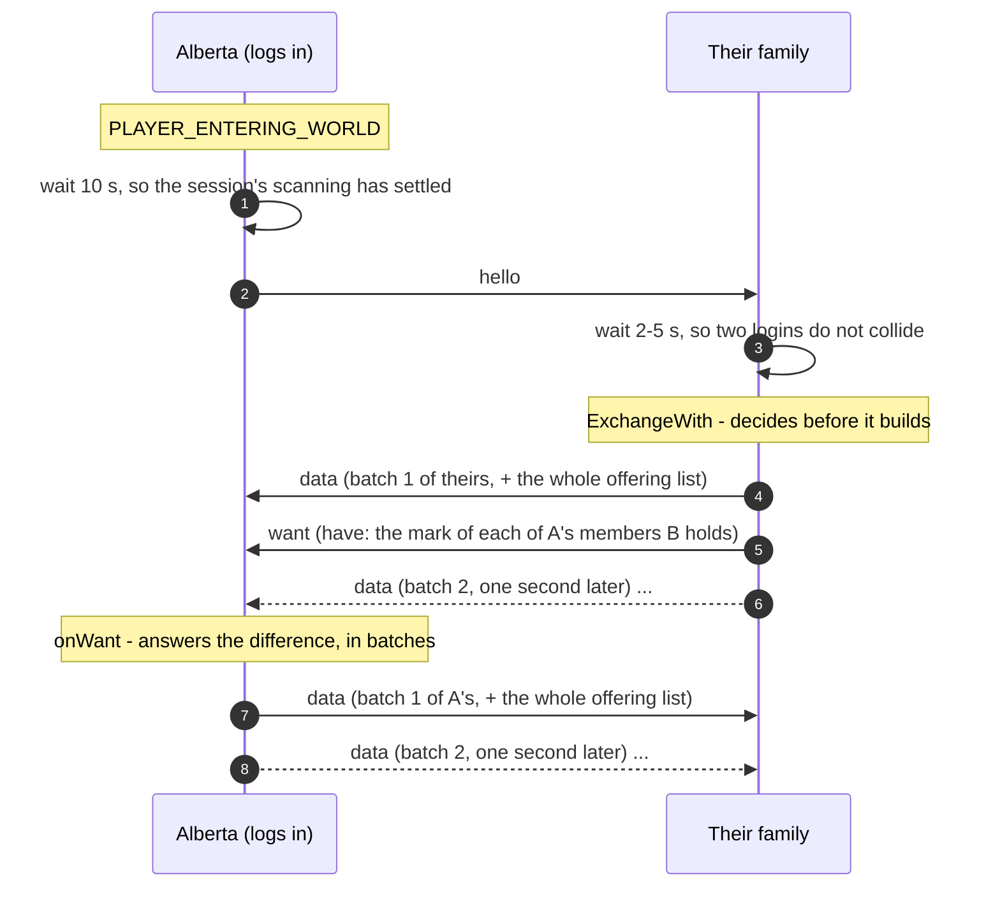
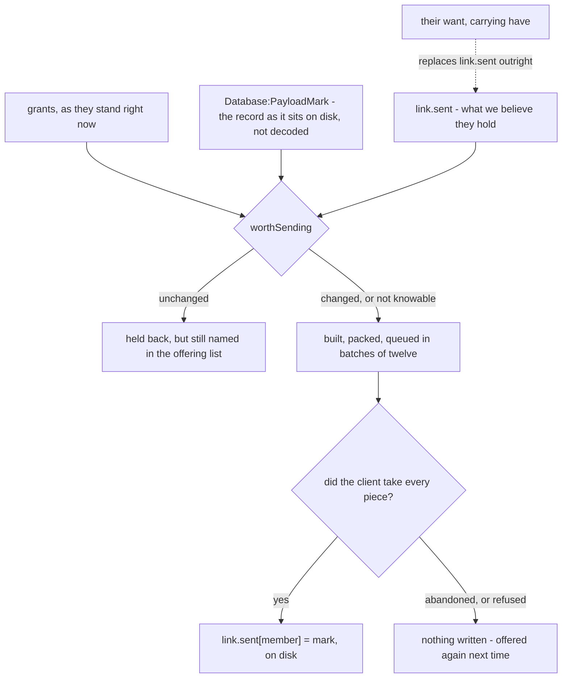

# Wide Family — how a transfer runs, and how long it takes

What happens between two linked families from the moment one of them logs in, what is written
down along the way, and what each of the ways a session can end costs.

The specification (§6) is authoritative on **behaviour** and this file does not restate it. What
is here is the shape of the machinery and the arithmetic, which the specification deliberately
does not carry.

Every number below is either read off a constant in this repository or worked out from one, and
each says which. Where a figure is an estimate it says that too, and gives the counted bound
beside it.

---

## 1. The pieces

    Wide.lua        decides what to send and to whom, keeps the marks, answers requests
    Comm.lua        cuts a body into addon messages, queues them, drains them at a fixed rate
    Codec.lua       serialises and compresses, and folds a record into a short mark
    Database.lua    the records themselves, and the mark of each as it sits on disk

A **link** is between two families, not two characters. A family is one installation — one
`FamilyDB`, which is `SavedVariables` and therefore per account and not per character. Two
accounts on one machine are two families that know nothing of each other.

Five kinds cross the wire. `link` and `linked` make the link, `unlink` ends it, and the two that
carry data are:

| Kind | Sent by | Carries |
|---|---|---|
| `hello` | whoever just logged in | nothing but who they are |
| `data` | either side | up to twelve members, and the full list of who is offered |
| `want` | either side | `have`: the mark of every member of theirs this side holds |

---

## 2. The wire, and what it costs

Three constants decide everything about the time a transfer takes. All three are in `Comm.lua`.

| Constant | Value | What it means |
|---|---|---|
| `LIMIT` | 252 | bytes in one addon message, the game's 255 less a margin |
| `PER_TICK` | 2 | messages handed to the client per tick |
| `TICK` | 0.2 | seconds between ticks |

The header — message id, piece number, piece count, kind, and a separator after each — is 18
bytes for a `data` message with a four-digit id, so **234 bytes of every message are the payload**
and ten messages leave every second:

    10 messages/s x 234 bytes = 2.3 KB per second

That is the whole budget, and it is **one queue for every link**. Fifteen linked families do not
transfer in parallel; their messages interleave in one list and share the same 2.3 KB a second.

**What a member costs.** Measured 2026-09-08 and recorded in `Codec.lua`: seventy shared
characters of the heavier sort pack to 211 KB at deflate level 1, which is the level bulk uses.
Batching costs about a quarter more, because compression sees a dozen members at a time instead
of all of them (`Wide.lua`). So:

    211 KB / 70 = 3.0 KB per member packed in one bundle
    + about a quarter          = 3.8 KB per member as it is actually sent
    / 2.3 KB per second        = about 1.6 seconds of wire per member

| How much is being shared | Bytes | Time on the wire |
|---|---|---|
| one member | 3.8 KB | 1.6 s |
| a batch of twelve | 46 KB | 20 s |
| 210 members, one link | 780 KB | **about 6 minutes** |
| 210 members, fifteen links | 11.7 MB | **about 90 minutes** |

The last row is the case Alberto asked about, and the ninety minutes is the sum rather than the
maximum: one queue, fifteen destinations.

**The queue runs twenty times ahead of the wire, and that is why marking matters.** A batch is
queued every second (`BATCH_GAP`), so all 210 members are in the queue within eighteen seconds
while the wire needs six minutes to carry them. Until 2026-09-08 a member was marked as sent when
its batch was *queued* — so half a minute into a six-minute transfer, this side had marked all 210
and delivered about 18. See §5.

---

## 3. A normal exchange, in order

**Both directions in one round trip** is §6's requirement, not an optimisation: asking is also
offering.

Three other things start an exchange, and nothing else does:

| Trigger | Delay | Asks for theirs? | Sends everything? |
|---|---|---|---|
| a login announcement heard | 2–5 s | yes | no, only what changed |
| a grant ticked or unticked | 3 s after the last click | **no** — it is telling, not asking | no |
| *Update now* on the panel | at once | yes | **yes**, whatever the marks say |

---

## 4. What is written down, and when

Four rules hold this together, and the fourth is the one that makes the other three safe to be
wrong about:

1. **Every payload is built from the grants at the moment of sending.** A grant taken away is
   taken away (§6).
2. **Every `data` message names the whole offering**, not only the members it carries. That is how
   *unchanged* and *withdrawn* stay two different sentences: anything named and not carried is
   unchanged, anything not named at all is forgotten by the far side.
3. **A mark is written when the client has taken every piece of its batch**, never when the batch
   was queued — and a transfer abandoned part way takes back the marks it had written.
4. **The side that has the records is the side that says what it holds.** Every member goes out
   carrying its mark; the next `want` hands the marks back; the answer is the difference. So
   nothing depends on this side's bookkeeping being right about a transfer that stopped.

---

## 5. What each way of ending a session costs

Two facts settle most of the table. **Nothing is sent on logout** — deliberately, §6: the client
is already leaving and a whisper posted then is not delivered. And **the outgoing queue is
memory**: whatever had not left is gone.

| What happens | On the wire | What this side keeps | When it resumes | What is lost |
|---|---|---|---|---|
| **Everyone stays online** | the whole transfer, at 2.3 KB/s | marks for every batch delivered | — | nothing |
| **Sender switches to another character** | the queue dies with the session | `FamilyDB` is per account, so the marks survive the switch | 12–15 s after entering the world, if the other family is still on | nothing — the undelivered batches are unmarked, so they are offered again |
| **Sender logs out, returns the next day** | as above | as above | the next time both are online at once | nothing; the records are simply a day older, and every panel says so |
| **Sender exits the game normally** | as above | as above | as above | nothing |
| **Sender alt-F4s or crashes** | as above | if the client dies without writing its saved variables, the marks revert to the last save — **which kills write them is not measured, and backlog 42 is the probe** | as above | nothing *of the marks*: one rolled back resends a member that was already there, and the `have` list corrects it anyway. What a lost save costs is everything else scanned that session, which is the reason to run the probe |
| **Sender disconnects** | identical to a logout from the wire's point of view | as above | as above | nothing |
| **One recipient goes offline mid-transfer** | the client refuses each whisper and says so in chat, one round trip later; up to four more messages leave before the first refusal arrives | the rest of the queue for them is dropped, the batch job is abandoned, **and the marks it wrote are taken back** | their next login announcement, or ours | nothing |
| **All of a recipient's characters are offline** | nothing is built at all — reachability is asked before the offering is assembled | the marks stand | as above | nothing |
| **A recipient alt-F4s** | as for the sender, on their side | they keep every message that arrived complete; a half-arrived one is dropped after 60 s of silence | their next login | the half-arrived message, which is resent whole |
| **Several recipients at once** | one queue, shared; total time is the sum | one job per link, independent | independently | nothing |

### The compound case: both sides leave, and the receiver comes back first

The rows above are single events. Put three of them in a row and the order decides who repairs
it, which is worth walking through once.

1. **A is ninety seconds into a six-minute transfer to B, and leaves.** However they leave —
   logout, Exit Game, alt-F4, a disconnect — the wire sees the same thing: the queue dies with
   the session and nothing is sent on the way out (§6). About 55 of A's 210 members have been
   delivered and are marked; the other 155 were sitting in the queue, and are not marked, because
   a mark is written on delivery.
2. **B leaves too.** B keeps every message that arrived complete — those 55 members, on disk,
   each with the mark A gave it. The one message that was still arriving is never completed and is
   dropped; it would have been swept after 60 seconds of silence in any case.
3. **B comes back first.** Ten seconds after entering the world B announces to A, and A is not
   there. The client refuses the whisper and says so a round trip later; Wide reads that as one
   candidate eliminated rather than as an answer, tries the next of A's characters, and so on down
   the list. Every attempt that got as far as sending is abandoned **and unmarked** when its
   refusal arrives, so B's own bookkeeping about what A holds is left exactly as it was. When the
   list runs out: *none of A's N characters are online*. Nothing is queued waiting for A, because
   there is nothing to wait with.
4. **A comes back, later.** Ten seconds in, A announces. B hears it, waits two to five seconds,
   and exchanges: B sends B's own delta, and a `want` carrying the marks of the 55 members of A's
   that B holds. A's `onWant` replaces its own bookkeeping with B's list and sends **the other 155
   and nothing else** — about four minutes, in the background.

The transfer costs the ninety seconds already spent plus the four minutes remaining, and nothing
crosses twice.

**The side that comes back last is the side that restarts it.** A login announces and pushes
nothing — what restarts an interrupted transfer is the *other* side hearing the announcement and
beginning an exchange, which carries the `want` that pulls the remainder out. B returning first
can do nothing but try and fail, and that is not a gap to be closed: there is nobody to send to.

**Unless the one already there has automatic exchange switched off**, in which case the
announcement is heard and ignored, and the transfer stays half-finished until somebody presses
*Update now*. That is what off means (§6) rather than an oversight, and it is the one combination
where a half-finished transfer waits indefinitely.

**And how either of them left does not matter to any of this.** Even where a hard kill loses the
saved variables (backlog 42), A comes back with older marks, offers more than it needs to, and is
immediately cut back to the truth by B's `have`. The one thing a lost save could take is a link
made during that same session, which is a link that never existed as far as the disk is concerned.

**What "resumes" means, exactly.** Not that the interrupted transfer is picked up mid-message —
it is not. It means the next exchange offers precisely the members the other side does not have,
because they said so, and carries neither the ones that arrived nor an apology for the ones that
did not.

---

## 6. The clock, in one place

Every delay Wide Family and Comm impose, with the file each is read from.

| Wait | Seconds | Why |
|---|---|---|
| entering the world → announcement | 10 | so the session's own scanning has settled first |
| announcement heard → exchange | 2–5, random | so two families logging in together do not collide |
| last grant clicked → exchange | 3 | one transfer for a column of ticks, not fourteen |
| between batches | 1 | the client packs a dozen members, not two hundred |
| first message → the rest, to somebody not heard from | 1.5 | one canary, so a refusal costs one line and not twenty |
| a name stays known-absent | 60 | long enough not to re-ask the server, short enough not to lock out somebody who just logged in |
| a half-arrived transfer is dropped | 60–75 | swept every 15 s, dropped after 60 s of silence |
| a link request goes unanswered | 120 | before the panel says so |

---

## 7. What is still not guaranteed

- **The channel acknowledges nothing, so Family acknowledges for it — lazily.** No addon message
  is confirmed by the game. The strongest signal that exists is *the client took every piece and
  refused none*, and that is what a mark is written from. The `have` list is the acknowledgement
  proper: it is cumulative, it arrives at the next exchange, and it makes delivery **eventually**
  certain for any pair who both run Family and are eventually online together. What it is not is
  prompt — inside one long transfer nothing is confirmed and nothing is retried, and a panel that
  says *sent* means *queued and taken*. Backlog 43 is the short `got` message that would close
  that, and what it still would not promise.
- **Reach across realms is settled and is not the open question.** Specification §11.1 was closed
  by the 1.0.0 pass — two families on unrelated realms exchanged — so a realm is not a boundary,
  and the one measured failure nearby is a different one: a character on a partner realm cannot
  *send* on the `GUILD` addon channel, which is Guild share's opening rather than a whisper. §6's
  own paragraph on this is older than §11.1 and reads as vaguer than what is now known.
- **Faction is the boundary nothing here has measured.** A whisper between Alliance and Horde is
  refused by the server on these clients; if that holds, a link cannot cross factions at all, and
  today Family would report it as *none of their N characters are online* — a sentence about
  somebody being offline when they are sitting in front of you. Backlog 44 is the probe and the
  sentence it should say instead.
- **A `want` now carries a line per member held.** For 210 members that is about 6.5 KB before
  compression — counted, from a 20-character key and a 10-character mark — so at most three
  seconds of wire per exchange, and in practice much less because a list of similar strings
  compresses well. That figure has not been measured on a client and it is the price of §4's
  fourth rule. Backlog 41 is the measurement, and the cheaper form if it turns out to be wanted.
